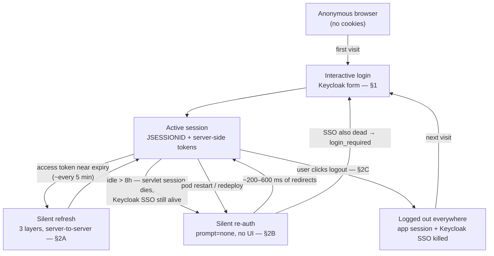
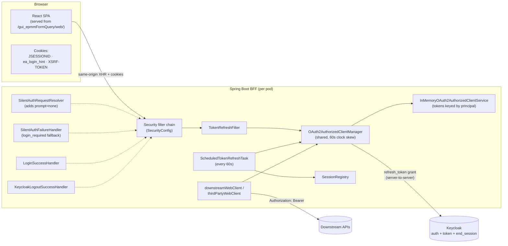
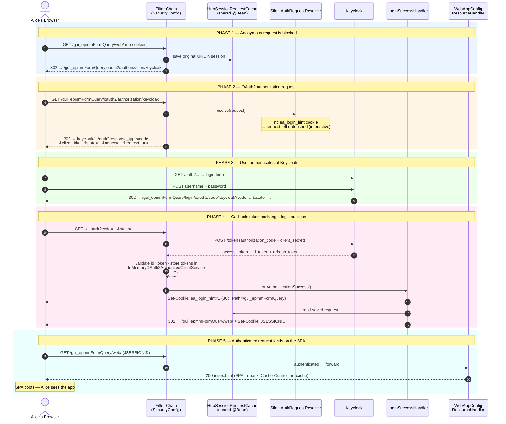
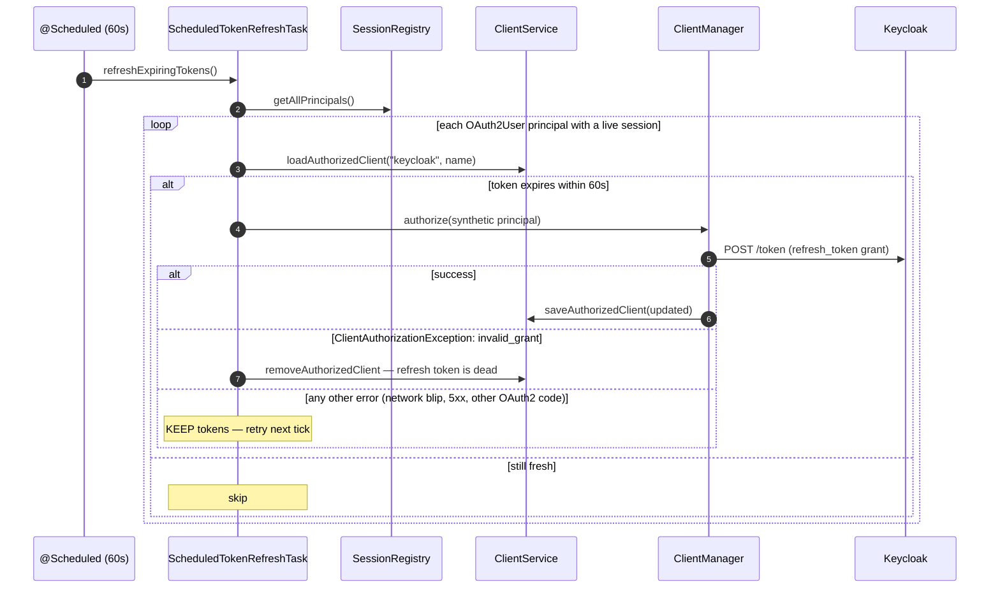
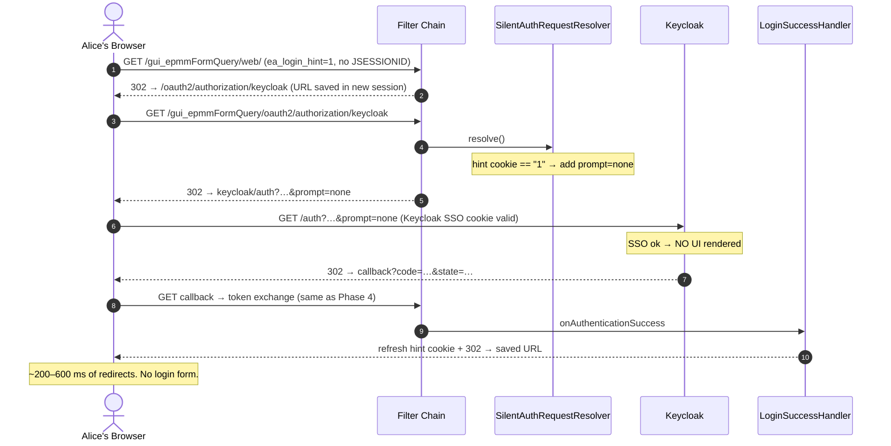
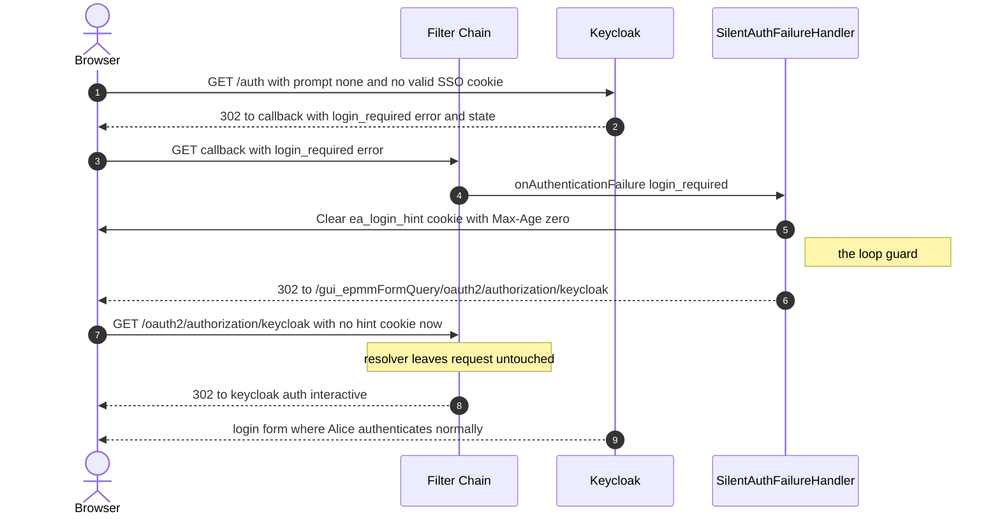
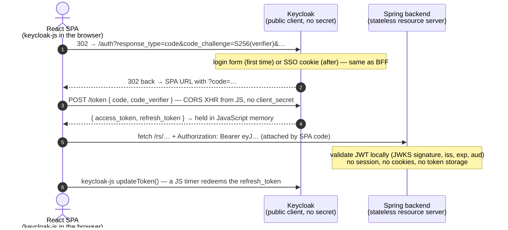

# Authentication Workflow — pmc-epmmformquerygui

> **Supersedes** `spring_first_login_workflow.md` and `spring_silent_auth_workflow.md` (both described the older "v4" iteration: Spring Boot 3.4.5, `AntPathRequestMatcher`, `CustomLogoutSuccessHandler`, CSRF-exempt `/rs/**`). This document is traced from the **current `backend/` source tree** — Spring Boot 3.5.x, Spring Security 6.5.x, Java 17, Keycloak OIDC, React-Vite SPA, Kubernetes + Istio.
>
> Companion docs: `docs/keycloak-realm-checklist.md` (realm settings), `docs/istio-stickiness.md` (mesh dependency, summarized in §4 here), `docs/reviews/2026-07-09-spring-oidc-oauth2-review.md` (best-practices review: known gaps + accepted deviations), `pmc-epmmformquerygui-COMPLETE.md` (full narrative reference), `docs/oauth2-migration-intro.md` (Traditional-Chinese team intro: OAuth2 basics + the Java 8 adapter → `oauth2Login` migration story).

---

## Contents

- [Intro — OAuth2 with Keycloak: the security lifecycle (DevOps primer)](#intro--oauth2-with-keycloak-the-security-lifecycle-devops-primer)
- [§0 — TL;DR and architecture map](#0--tldr-and-architecture-map)
- [§1 — First-time login (Phases 1–5)](#1--first-time-login-phases-15)
- [§2 — Staying logged in](#2--staying-logged-in)
  - [§2A — Token refresh: three layers, one manager](#2a--token-refresh-three-layers-one-manager)
  - [§2B — Silent re-authentication (`prompt=none`)](#2b--silent-re-authentication-promptnone)
  - [§2C — Explicit logout](#2c--explicit-logout)
- [§3 — When does the user see the login form?](#3--when-does-the-user-see-the-login-form)
- [§4 — Istio DestinationRule: `useSourceIp` vs `httpCookie`](#4--istio-destinationrule-usesourceip-vs-httpcookie)
- [§5 — BFF: what it is and why it is the right model here](#5--bff-what-it-is-and-why-it-is-the-right-model-here)
- [Appendix — Known code/config drift](#appendix--known-codeconfig-drift)

---

## Intro — OAuth2 with Keycloak: the security lifecycle (DevOps primer)

*New to OAuth2? Start here. This section explains, in operations language, what the auth machinery does and which knobs you own. Everything is expanded with full detail in §0–§5.*

### What OAuth2 / OIDC / Keycloak are, in one breath each

| Term | What it actually is |
|---|---|
| **OAuth2** | A protocol where an app never sees the user's password. The app redirects the browser to a trusted **authorization server**, the user logs in *there*, and the app receives short-lived **tokens** it can spend on APIs on the user's behalf |
| **OIDC** (OpenID Connect) | A thin layer on top of OAuth2 that adds *identity*: an **ID token** that cryptographically states "this is alice, verified at 09:00". OAuth2 = what you may do; OIDC = who you are |
| **Keycloak** | Our authorization server. It owns the login form, the passwords/SSO sessions, and the token factory. The app is registered in it as a **client** (with a secret only the pod knows) |
| **BFF** (this app) | *Backend-for-Frontend*: the Spring Boot backend does all of the above **server-side**. The browser never holds a token — only cookies. That is the property that makes this design defensible in a security audit (§5) |

The three tokens Keycloak issues at login, and their operational meaning:

| Token | Lifetime here | Ops meaning |
|---|---|---|
| **Access token** | ~5 min | The "cash" spent on downstream API calls. Short on purpose — a stolen one dies in minutes |
| **Refresh token** | Tied to the SSO session | The "debit card" the backend redeems (server-to-server) for fresh access tokens. Never leaves the pod |
| **ID token** | Login-time | Proof of identity; also required later to make logout skip Keycloak's "are you sure?" screen (§2C) |

### The lifecycle at a glance



Reading it as a DevOps story:

1. **First login (§1):** anonymous request → 302 to Keycloak → user authenticates **at Keycloak** (the app never sees the password) → Keycloak redirects back with a one-time code → the pod swaps code + `client_secret` for the three tokens, stores them **in pod memory**, and gives the browser a session cookie.
2. **Staying logged in (§2A):** the access token dies every ~5 min by design. Three cooperating refresh layers (per-request filter, on-demand WebClient hook, 60 s scheduler) redeem the refresh token server-to-server so the user never notices. **No browser traffic is involved.**
3. **Coming back after hours (§2B):** the app's 8 h session may be gone while Keycloak's SSO session (10 h idle) survives. The app retries login with `prompt=none` — Keycloak recognizes its own SSO cookie and issues a fresh code **without rendering any UI**. The user sees a sub-second redirect flash, not a form.
4. **Logout (§2C):** kills *both* sessions — the app's and Keycloak's SSO — plus the hint cookie. Next visit is a real login form, by design.
5. **Pod restart / redeploy:** in-memory tokens vanish; users recover through the silent path (3) with one blip. This is an accepted trade-off, not a bug — see D4 in the review's deviations register.

### What the browser holds (and what it never holds)

Only three cookies — `JSESSIONID` (the session), `ea_login_hint` (a "silent login is worth trying" flag), `XSRF-TOKEN` (CSRF double-submit). **No access token, no refresh token, no ID token — ever.** Details in §0.

### The knobs DevOps owns

| Knob | Where | Value / rule | Breaks what if wrong |
|---|---|---|---|
| `KEYCLOAK_CLIENT_ID` / `KEYCLOAK_CLIENT_SECRET` / `KEYCLOAK_ISSUER_URI` | Pod env vars | Per environment | Startup / all logins |
| `DOWNSTREAM_API_URL`, `THIRD_PARTY_API_URL` | Pod env vars | Per environment | Backend API calls |
| Servlet session timeout | `application.yml` (`server.servlet.session.timeout`) | **8h** | The silent-login guarantee (next row) |
| SSO Session Idle | Keycloak realm | **10h — MUST stay ≥ the 8h above** | "Idle then return" shows the login form instead of being silent |
| SSO Session Max | Keycloak realm | 12–14h (longest workday) | Active users get kicked mid-work when it lapses |
| Access Token Lifespan | Keycloak realm | ~5 min | Longer = bigger stolen-token window; shorter = more refresh traffic |
| Revoke Refresh Token | Keycloak realm | **OFF** (deliberate — see review D1) | ON causes racing refreshes → random logouts |
| Valid Redirect URIs / Post Logout Redirect URIs | Keycloak client | Exact URLs per env | Login / logout redirect rejected by Keycloak |
| Istio `DestinationRule` `consistentHash` | Mesh config | **Load-bearing — never remove** (verify per `docs/istio-stickiness.md`) | Intermittent bare 401s and broken API calls with >1 replica |

Full realm settings: `docs/keycloak-realm-checklist.md`. Mesh dependency: `docs/istio-stickiness.md`.

### Known gaps and accepted trade-offs

This design was reviewed against RFC 9700 and the IETF browser-based-apps BCP on 2026-07-09. The findings — one High (forwarded-headers config behind Istio TLS termination), six Mediums, and the accepted-deviations register (no token rotation, no back-channel logout, in-memory state + stickiness) — live in `docs/reviews/2026-07-09-spring-oidc-oauth2-review.md`. Read its Appendix A before changing any proxy, domain, or Keycloak topology: several safety properties are conditional on environment facts only ops can confirm.

---

## §0 — TL;DR and architecture map

The backend is a **Backend-for-Frontend (BFF)**: a Spring Boot app that hosts the React SPA, logs users in against Keycloak with server-side `oauth2Login`, keeps all tokens **server-side**, and proxies downstream API calls with an automatically attached `Authorization: Bearer` header. The browser only ever holds three cookies — none of them is a token:

| Cookie | Who sets it | Purpose | Lifetime |
|---|---|---|---|
| `JSESSIONID` | Tomcat | Servlet session (holds `SecurityContext`) | Session cookie; server-side timeout **8h** |
| `ea_login_hint` | `LoginSuccessHandler` | "This browser has logged in before" → enables silent re-auth | **30 days**, `Path=/gui_epmmFormQuery`, HttpOnly, Secure |
| `XSRF-TOKEN` | `CookieCsrfTokenRepository` | CSRF double-submit token, readable by the SPA's JS | Session cookie |



### Configuration baseline

Every path decision below is driven by these values from `backend/src/main/resources/application.yml`:

| Property | Value |
|---|---|
| `app.context-prefix` | `/gui_epmmFormQuery` |
| `app.frontend.url-prefix` | `/gui_epmmFormQuery/web` |
| `app.frontend.resource-location` | `classpath:/gui_epmmFormQuery/web/` |
| `app.token-refresh.enabled` / `skew-seconds` / `schedule-rate-ms` | `true` / `60` / `60000` |
| `app.silent-auth.hint-cookie-name` / `hint-cookie-max-age-seconds` / `cookie-secure` | `ea_login_hint` / `2592000` (30 d) / `true` |
| `app.post-logout-redirect-uri` | `https://myapp.example.com/gui_epmmFormQuery/page/logged-out` |
| `server.servlet.session.timeout` | `8h` (cookie: `SameSite=lax`, `Secure`, `HttpOnly`) |
| `server.servlet.context-path` | **NOT SET — deliberate** |
| `spring.security.oauth2...user-name-attribute` | `preferred_username` |

**The "no context-path" rule.** Because `server.servlet.context-path` is empty, Tomcat hands the **full** URL — including `/gui_epmmFormQuery` — to Spring Security and the DispatcherServlet. Every protected pattern in `SecurityConfig` is therefore built as `contextPrefix + "/..."`, and `oauth2Login` needs two explicit overrides that Spring would otherwise default to un-prefixed paths:

```java
// SecurityConfig — derived URL locals
String authBaseUri     = contextPrefix + "/oauth2/authorization";   // /gui_epmmFormQuery/oauth2/authorization
String callbackPattern = contextPrefix + "/login/oauth2/code/*";    // /gui_epmmFormQuery/login/oauth2/code/*
String logoutUrl       = contextPrefix + "/logout";                 // GET /gui_epmmFormQuery/logout
String deniedPageUrl   = contextPrefix + "/page/access-denied";
```

Do not "simplify" by introducing a context-path — the Istio VirtualService only routes `/gui_epmmFormQuery/*`, and the prefix-everywhere convention is what keeps Security patterns, controllers, and the resource handler in agreement.

---

## §1 — First-time login (Phases 1–5)

**Scenario:** Alice opens a fresh browser and types:

```
https://myapp.example.com/gui_epmmFormQuery/web/
```

She has no `JSESSIONID`, no `ea_login_hint` cookie, no Keycloak SSO session — and valid credentials.



### Phase 1 — Anonymous request is blocked

The request walks the chain (order set in `SecurityConfig`):

| # | Filter | What it does for this request |
|---|---|---|
| 1 | `RequestTracingFilter` (`FilterRegistrationBean`, `HIGHEST_PRECEDENCE`, `/*`) | Puts an 8-char `traceId` into the MDC |
| 2 | CORS filter (`CorsConfig.corsConfigurationSource`) | Same-origin → pass |
| 3 | `SecurityContextHolderFilter` | No session → anonymous |
| 4 | `SecurityLoggingFilter` (after `SecurityContextHolderFilter`) | Logs path + auth state at DEBUG |
| 5 | `TokenRefreshFilter` (after `SecurityContextHolderFilter`) | Not an `OAuth2AuthenticationToken` → no-op |
| 6 | `PrivilegeCheckFilter` (before `AuthorizationFilter`) | Stub; inert while `app.privilege.enabled=false` |
| 7 | `AuthorizationFilter` | Path not in permitAll list → reject |

The permitAll list — everything else, including the SPA under `/web/**`, requires authentication:

```
/actuator/health   /actuator/health/**   /error   /favicon.ico
/gui_epmmFormQuery/page/**   /gui_epmmFormQuery/rs/gui/ping
```

On rejection, Spring Security saves the original URL in the **shared** `HttpSessionRequestCache` and 302s to the authorization endpoint.

> **Why the request cache is a `@Bean` and must stay one.** `SecurityConfig` declares `httpSessionRequestCache` as a top-level bean with `setMatchingRequestParameterName(null)` ("replay the saved URL regardless of query params"). The **same instance** is registered on the filter chain (which *writes* the saved request) and injected into `LoginSuccessHandler` (which *reads* it in Phase 4). Inlining it as a local variable breaks startup with `UnsatisfiedDependencyException`.

### Phase 2 — Authorization request (and where silent auth would hook in)

`OAuth2AuthorizationRequestRedirectFilter` matches because `authorizationEndpoint.baseUri` is explicitly `/gui_epmmFormQuery/oauth2/authorization`. Before redirecting, it asks **`SilentAuthRequestResolver`** to build the request. The resolver wraps `DefaultOAuth2AuthorizationRequestResolver` and applies exactly one customization:

- `ea_login_hint` cookie present **with value `"1"`** → add `prompt=none` (silent; see §2B)
- otherwise → pass through untouched (interactive — this phase, first visit)

The redirect to Keycloak carries `response_type=code`, `scope=openid profile email`, a random `state` (anti-CSRF, saved **in the servlet session** — remember this for §4), a `nonce`, and `redirect_uri={baseUrl}/gui_epmmFormQuery/login/oauth2/code/keycloak`.

### Phase 3 — Keycloak shows the login form

Entirely Keycloak-side. On success it creates its **SSO session** (its own cookie on the Keycloak domain) and 302s back to the callback with `code` and `state`.

### Phase 4 — Callback, token exchange, login success

`OAuth2LoginAuthenticationFilter` matches the explicit `redirectionEndpoint.baseUri` pattern. It:

1. Verifies `state` against the value saved in the session (Phase 2 — **same pod required**, see §4).
2. Exchanges the code server-to-server: `POST /token` with `client_id` + `client_secret` (confidential client — the secret never touches the browser).
3. Validates the `id_token` (signature via JWKS, `exp`, `aud`, `nonce`); maps `preferred_username` to `Authentication.getName()`.
4. Stores the `OAuth2AuthorizedClient` (access + refresh token) via `AuthenticatedPrincipalOAuth2AuthorizedClientRepository` → **`InMemoryOAuth2AuthorizedClientService`**, keyed by `("keycloak", principalName)` — *not* by session. That is what lets the scheduler and multiple tabs share one token set (§2A).
5. Invokes `LoginSuccessHandler` (extends `SavedRequestAwareAuthenticationSuccessHandler`), which:
   - sets the hint cookie: `ea_login_hint=1`, `Max-Age=2592000` (30 d), `Path=/gui_epmmFormQuery`, `HttpOnly`, `Secure` (configurable via `app.silent-auth.cookie-secure` for plain-HTTP local dev);
   - replays the saved request from the shared cache, falling back to `/gui_epmmFormQuery/web/`.

#### Deep dive: the save path in step 4, and what the store actually holds

Step 4 compresses three classes into one arrow. The handoff matters because the HTTP request and session are **dropped mid-chain** — only the principal survives as the key:

```
OAuth2LoginAuthenticationFilter                         (Spring internal — has tokens + authenticated principal)
   │  saveAuthorizedClient(authorizedClient, authentication, request, response)
   ▼
AuthenticatedPrincipalOAuth2AuthorizedClientRepository  (adapter, from TokenRefreshConfig)
   │  principal is authenticated (not anonymous) → request/response are DISCARDED
   │  saveAuthorizedClient(authorizedClient, principal)      ← no session in sight from here on
   ▼
InMemoryOAuth2AuthorizedClientService                   (one ConcurrentHashMap for the whole JVM)
   map.put(OAuth2AuthorizedClientId("keycloak", "alice"), authorizedClient)
```

(Only an *anonymous* principal would make the adapter fall back to session storage — that never happens behind `oauth2Login`.)

One map entry looks like this — `principalName` is `Authentication.getName()`, i.e. the `preferred_username` claim per `application.yml`:

```text
// ── KEY ──────────────────────────────────────────────────────────────
OAuth2AuthorizedClientId {
  clientRegistrationId : "keycloak"        // spring.security.oauth2.client.registration.keycloak
  principalName        : "alice"           // preferred_username — NOT a session id
}

// ── VALUE ────────────────────────────────────────────────────────────
OAuth2AuthorizedClient {
  clientRegistration : { registrationId: "keycloak", clientId: "pmc-epmmformquerygui",
                         tokenUri: "https://keycloak…/protocol/openid-connect/token", … }
  principalName      : "alice"
  accessToken  : {
    tokenValue : "eyJhbGciOiJSUzI1NiIs…"   // the Bearer value the WebClients attach (§2A)
    issuedAt   : 2026-07-04T09:00:00Z
    expiresAt  : 2026-07-04T09:05:00Z      // short-lived (~5 min at Keycloak default)
    scopes     : [openid, profile, email]
  }
  refreshToken : {
    tokenValue : "eyJhbGciOiJIUzUxMiIs…"   // what all three §2A refresh layers redeem
    issuedAt   : 2026-07-04T09:00:00Z
  }
}
```

Why the principal key (not the session) matters — every consumer that knows the user's *name* resolves the same single entry, no `HttpServletRequest` required:

| Consumer | Lookup | Would work with Spring's session-scoped default? |
|---|---|---|
| `TokenRefreshFilter` (per request) | `loadAuthorizedClient("keycloak", auth.getName())` | Yes — it has the request |
| WebClient beans (outgoing calls) | shared manager → same key | Unreliable — background threads lack a request context |
| `ScheduledTokenRefreshTask` (60 s) | iterates `SessionRegistry` principals → same key per user | Impossible — a scheduler has no HTTP session at all |
| Second tab / second session, same user | different `JSESSIONID`, same `preferred_username` → same entry | No — each session would hold its own token copy |

The flip side of one shared entry per user: concurrent refreshes from two code paths can race on the same refresh token — one more reason the realm keeps *Revoke Refresh Token: OFF* (§2A).

### Phase 5 — Authenticated request reaches the SPA

Same chain, but `SecurityContextHolderFilter` now loads Alice's `OAuth2AuthenticationToken` from the session and `AuthorizationFilter` passes. No controller maps `/web/**`; `WebAppConfig`'s resource handler does, with a custom `PathResourceResolver` fallback order:

1. direct lookup → 2. classpath lookup → 3. asset path-stripping (for extensioned paths) → 4. **no recognized extension → serve `index.html`** (SPA-route fallback, `Cache-Control: no-cache`).

The browser then fetches the Vite bundle (`/gui_epmmFormQuery/web/assets/index-*.js`, CSS, …) through the same authenticated chain, and the SPA boots. From its first response onward, `CookieCsrfTokenRepository.withHttpOnlyFalse()` + `SpaCsrfTokenRequestHandler` keep an `XSRF-TOKEN` cookie fresh; the SPA reads it in JS and echoes it as the `X-XSRF-TOKEN` header on state-changing `/rs/**` calls. **Only the logout URL is CSRF-exempt** — the old v4 doc's blanket `/rs/**` exemption is gone.

---

## §2 — Staying logged in

The design goal: after Phase 3 above, Alice should never see the Keycloak form again until something *real* expires (§3 says exactly when). Two mechanisms cooperate:

- **Token refresh** (§2A) — while the servlet session is alive, keep the access token fresh using the refresh token. Invisible: server-to-server only.
- **Silent re-auth** (§2B) — when the servlet session is dead but Keycloak's SSO session is alive, run the whole OAuth2 dance with `prompt=none` so Keycloak never renders UI. Near-invisible: a flash of redirects.

### §2A — Token refresh: three layers, one manager

All three layers call the **same** `OAuth2AuthorizedClientManager` (an `AuthorizedClientServiceOAuth2AuthorizedClientManager` from `TokenRefreshConfig`, refresh provider clock skew **60 s**), which reads and writes the **same** `InMemoryOAuth2AuthorizedClientService`. The manager is a no-op while the access token has more than 60 s left; inside that window it transparently runs the `refresh_token` grant.

| Layer | Component | When it fires | On failure |
|---|---|---|---|
| 1. Proactive | `TokenRefreshFilter` (every authenticated request) | Request arrives while token is inside the 60 s skew window | Logs a warning, request proceeds; tokens are **not** dropped |
| 2. Reactive | `ServletOAuth2AuthorizedClientExchangeFilterFunction` inside `downstreamWebClient` / `thirdPartyWebClient` | A WebClient call needs a token | Exception propagates to the caller |
| 3. Scheduled | `ScheduledTokenRefreshTask` (every 60 s) | Idle users' tokens enter the skew window | Drops tokens **only on `invalid_grant`**; anything else retries next tick |

**Layer 1 — proactive.** Sits right after `SecurityContextHolderFilter`. If the current `Authentication` is an `OAuth2AuthenticationToken`, it calls `manager.authorize(...)`. By the time controllers or WebClients run, the stored token is normally already fresh.

**Layer 2 — reactive.** The two WebClient beans (always inject by `@Qualifier`; base URLs from `app.downstream.base-url` / `app.third-party.base-url`) attach `Authorization: Bearer` automatically through the shared manager. **Never set the Authorization header manually** — that bypasses the refresh logic and produces sporadic 401s. This replaces the old v4 pattern of controllers calling `manager.authorize()` by hand. Claims for outgoing calls (e.g. the `X-Acting-User` header in `DownstreamApiClient`) come from `UserInfoService`, which reads the already-validated `OidcUser` — no extra Keycloak round trip.

**Layer 3 — scheduled.** Why: an idle-but-logged-in user (browser open, no requests) triggers neither layer 1 nor 2. The task (gated by `app.token-refresh.enabled`, on by default):



It knows who is logged in via the `SessionRegistry` (populated because `SecurityConfig` sets `sessionManagement().maximumSessions(-1).sessionRegistry(...)`, kept accurate by `HttpSessionEventPublisher`). The synthetic `UsernamePasswordAuthenticationToken` principal works because the manager only needs `principal.getName()`.

> **The `invalid_grant`-only rule matters.** An early iteration dropped tokens on *any* exception — so a 30-second Keycloak network blip silently logged out every idle user. Only `invalid_grant` proves the refresh token itself is dead.

**Side effect that shapes §3:** every successful refresh grant resets Keycloak's *SSO Session Idle* timer. While any servlet session lives, the scheduler keeps SSO alive indefinitely (up to *SSO Session Max*).

**Keycloak settings this depends on** (full list in `docs/keycloak-realm-checklist.md`): *Revoke Refresh Token: OFF* — with rotation ON, two concurrent refreshes (two tabs, or filter + scheduler racing) make the second one fail `invalid_grant` and break the session. *SSO Session Idle ≥ servlet session timeout (8h)* — use 10h — otherwise "idle then return" stops being silent.

### §2B — Silent re-authentication (`prompt=none`)

**Scenario B1 — the happy path.** Alice closed her browser at 12:00 (session cookie `JSESSIONID` deleted on close), and returns at 14:30. Her `ea_login_hint` cookie (30 d) is still there; Keycloak's SSO session is still alive.



**Scenario B2 — SSO expired: fail silently, then fall back.** Same start, but Keycloak's SSO Session Idle has lapsed. With `prompt=none` Keycloak is forbidden to render UI, so it answers `?error=login_required`. `SilentAuthFailureHandler` catches it:



The handler acts only on error codes **`login_required`** and **`interaction_required`**; everything else goes to the default `SimpleUrlAuthenticationFailureHandler`.

> **The cookie-clear is the infinite-redirect-loop guard.** If the hint cookie survived the failure, the retry would re-add `prompt=none`, fail `login_required` again, redirect again — forever. Clearing it on first failure guarantees the retry is interactive. Corollary: the *clear* must actually work in the browser. The clearing cookie must match the original's `Path` (`/gui_epmmFormQuery`) — and if `cookie-secure=true` cookies are set over plain HTTP they're never stored/cleared consistently, which is why `app.silent-auth.cookie-secure` exists as a local-dev escape hatch.

#### Deep dive: why Keycloak accepts `prompt=none` without a form

There are **two independent sessions**, and in scenario B1 only one of them died:

| Cookie | Sent to | Proves | Lifetime |
|---|---|---|---|
| `JSESSIONID` | app domain (`myapp.example.com`) | servlet session with the BFF | 8 h idle — **this is what died** |
| `KEYCLOAK_IDENTITY` (+ `KEYCLOAK_SESSION`, `AUTH_SESSION_ID`) | Keycloak domain only | live SSO session inside Keycloak itself | SSO Idle 10 h / SSO Max — **this is still alive** |
| `ea_login_hint` | app domain | nothing — just "this browser logged in before, silent is worth trying" | 30 d |

`prompt=none` does **not** skip authentication. Per the OIDC spec it means: *authenticate using only what the browser already carries, and if any UI would be needed, return an error instead of rendering it.* What the browser still carries — for the Keycloak domain — is `KEYCLOAK_IDENTITY`: a signed token referencing Keycloak's own server-side SSO session. Keycloak validates it, finds the SSO session within its idle window, and issues a fresh authorization code with zero UI. The user's authentication never lived in our app; losing `JSESSIONID` only lost the *app's copy* of the login. This is the same mechanism that gives any second OIDC app instant SSO — here the "second app" is our own app coming back after its session died.

The realm rule *SSO Session Idle (10 h) ≥ servlet timeout (8 h)* exists precisely so that whenever `JSESSIONID` expires, `KEYCLOAK_IDENTITY` is still guaranteed valid — the silent path can't miss (and §2A's scheduler keeps resetting the idle timer while any session lives).

On the wire:

```text
# B1 — the authorization request Spring built (the only change is the last param)
GET https://keycloak.example.com/realms/epmm/protocol/openid-connect/auth
    ?response_type=code
    &client_id=pmc-epmmformquerygui
    &scope=openid+profile+email
    &state=xYz9pQ…                    # anti-CSRF, held in the new servlet session — §4 stickiness!
    &redirect_uri=https://myapp.example.com/gui_epmmFormQuery/login/oauth2/code/keycloak
    &nonce=n-0S6…
    &prompt=none                      # added by SilentAuthRequestResolver
Cookie: KEYCLOAK_IDENTITY=eyJhbGciOiJIUzI1NiIs…; KEYCLOAK_SESSION=epmm/8d1e…; AUTH_SESSION_ID=…

# B1 success — a fresh code, zero UI
HTTP/1.1 302 Found
Location: https://myapp.example.com/gui_epmmFormQuery/login/oauth2/code/keycloak
          ?code=8c2f61b0-…&state=xYz9pQ…&session_state=8d1e…

# B2 failure — an error instead of a login page
HTTP/1.1 302 Found
Location: https://myapp.example.com/gui_epmmFormQuery/login/oauth2/code/keycloak
          ?error=login_required&state=xYz9pQ…
```

### §2C — Explicit logout

`GET /gui_epmmFormQuery/logout` (matched by `PathPatternRequestMatcher` — `AntPathRequestMatcher` is removed in Spring Security 7; the logout URL is the single CSRF exemption). Spring invalidates the session, clears authentication, deletes `JSESSIONID`, then calls **`KeycloakLogoutSuccessHandler`**, which extends Spring's `OidcClientInitiatedLogoutSuccessHandler`:

1. Clears `ea_login_hint` — otherwise the next visit would silently re-login, making logout look broken.
2. Delegates to `super`, which builds the OIDC RP-initiated logout URL to Keycloak's `end_session` endpoint **with `id_token_hint` and `client_id`** (this is why we extend the framework handler rather than hand-building the URL — Keycloak requires these to skip its "are you sure?" screen and to validate `post_logout_redirect_uri`), redirecting to `app.post-logout-redirect-uri` → the public `/page/logged-out` page.

Both the Spring session **and** the Keycloak SSO session are dead afterwards; the next visit is a full interactive login by design.

---

## §3 — When does the user see the login form?

Key mechanism to keep in mind: while a servlet session is alive, the scheduler (§2A layer 3) keeps refreshing tokens, and **every refresh grant resets Keycloak's SSO Session Idle timer**. SSO Idle only starts counting down after the servlet session dies (8h idle) or the pod restarts.

| # | Scenario | Code path | Form shown? |
|---|---|---|---|
| a | Active use past access-token lifespan (~5 min) | [§2A layer 1/2]: refresh grant within 60 s skew | **No** |
| b | Idle < 8h (servlet session alive) | [§2A layer 3]: scheduler keeps refreshing; session cookie valid on return | **No** |
| c | Idle > 8h, Keycloak SSO still alive | [§2B B1]: dead session → saved request → `prompt=none` → silent code → URL replayed | **No** (302 "flash") |
| d | Idle > 8h AND SSO Idle lapsed | [§2B B2]: `login_required` → hint cleared → interactive | **Yes** |
| e | SSO Session Max reached mid-work | Refresh fails `invalid_grant` → scheduler drops client → API calls fail → next full redirect | **Yes** — preceded by a window of broken API calls; unsaved SPA state lost |
| f | Single pod restart / redeploy | In-memory state gone → row (c) silent re-auth if SSO alive | **No** (one blip; in-flight XHRs fail once) |
| g | Multi-pod, stickiness broken | [§4] | **No form — worse:** intermittent bare 401 pages and broken API calls |
| h | 2 tabs + scheduler refresh race | Rotation OFF (required): shared refresh token, no race | **No** (transient errors if rotation is ever turned ON) |
| i | Explicit logout | [§2C]: session + hint cookie + Keycloak SSO all killed | **Yes** on next visit (by design) |
| j | Keycloak restart (non-persisted sessions) | SSO + refresh tokens gone → same as (e) | **Yes** |
| k | Hint cookie present, SSO dead | [§2B B2]: one failed silent round-trip, no loop | **Yes** (one extra redirect hop) |
| l | Refresh-token max lifespan hit while active | Same mechanics as (e) | **Yes** |
| m | New browser / device / cleared cookies | No hint cookie → [§1] interactive flow | **Yes** (expected) |

**One-line summary:** on healthy infrastructure the form appears only on first visit/new device (m), explicit logout (i), idle longer than servlet 8h **plus** SSO Idle (d), hitting the SSO Session Max ceiling (e/l), or Keycloak losing its sessions (j). Everything else is silent.

**Documented trade-off:** because the scheduler keeps SSO alive as long as any servlet session exists, *SSO Session Idle is **not** an idle-logout security control* in this design. An abandoned open browser stays logged in until SSO Session Max. If the security team needs idle logout, it must be enforced elsewhere (e.g. SPA inactivity timer that calls `/logout`).

---

## §4 — Istio DestinationRule: `useSourceIp` vs `httpCookie`

### Why stickiness is load-bearing, not an optimization

Three pieces of auth state live **in memory, per pod**:

1. **`HttpSession`** — the `SecurityContext` (who you are) and the saved request.
2. **The in-flight OAuth2 `state`** — saved in the session in Phase 2, verified in Phase 4. If the callback lands on a different pod than the one that issued the redirect, verification fails with **`authorization_request_not_found`** → bare 401 during login.
3. **The `OAuth2AuthorizedClient`** (access + refresh tokens) in `InMemoryOAuth2AuthorizedClientService`.

With more than one replica, correctness depends entirely on the mesh sending each user to the *same pod every time*. That is the job of the app's `DestinationRule` → `trafficPolicy.loadBalancer.consistentHash`. Remove or weaken it (e.g. `simple: ROUND_ROBIN`) and rows (a)–(f) of §3 degrade into row (g): no login form, just intermittent 401s and broken API calls that look like random flakiness.

### `useSourceIp` — the current setting, and why it is fragile

`consistentHash.useSourceIp: true` hashes whatever source IP the app's sidecar sees. Three real-world failure modes:

| Failure mode | What happens |
|---|---|
| Traffic arrives via the ingress gateway | The "source IP" is often the **gateway pod's** IP. One gateway replica funnels all its users onto one app pod (hotspot) — and with multiple gateway replicas, the *same user* can arrive from *different* gateway IPs and land on *different* app pods: stickiness silently broken |
| Corporate NAT | Hundreds of users share one egress IP → they all hash to one pod |
| Mobile / roaming clients | Client IP changes mid-session → user hops pods → one auth blip (row f) per hop |

The nasty property: it works perfectly in a one-replica dev environment and fails probabilistically in production.

### `httpCookie` — the recommended setting

```yaml
trafficPolicy:
  loadBalancer:
    consistentHash:
      httpCookie:
        name: epmm-affinity
        ttl: 0s        # session cookie, issued by Envoy automatically
```

Envoy issues the `epmm-affinity` cookie itself on the first response and hashes on it thereafter. The affinity identity is now *the browser*, not the network path — immune to gateway hops, NAT, and IP changes. `ttl: 0s` makes it a session cookie: closing the browser drops the pin, and the next visit simply gets pinned to a (possibly different) pod and silently re-auths (§3 row c/f behavior at worst).

Note this is a *fourth* cookie next to the three in §0 — issued and consumed by Envoy, invisible to Spring.

**Verification** (must hold in *every* environment, and must target the **app's** Service host — a rule on the Keycloak service protects nothing):

```
kubectl get destinationrule -A -o yaml | grep -B4 -A6 consistentHash
```

### The only correct way to remove the DestinationRule

Externalize the state instead: `spring-session-jdbc` (sessions + saved requests + `state`), `JdbcOAuth2AuthorizedClientService` (tokens), and a ShedLock-guarded scheduler (so N pods don't refresh the same user N times). That design is spec Appendix A. Until it is implemented, the DestinationRule **is** the session store's replication mechanism.

---

## §5 — BFF: what it is and why it is the right model here

### What a BFF is

A **Backend-for-Frontend** is a server-side companion that belongs to *one specific frontend* and handles the OAuth2/OIDC work on its behalf:

- The BFF — not the SPA — is the **OAuth2 client**. It is a *confidential* client: it authenticates to Keycloak with a `client_secret` that exists only in the pod's environment.
- **Tokens never reach the browser.** Access, refresh, and ID tokens live server-side (here: `InMemoryOAuth2AuthorizedClientService`). The browser's only credential is a plain session cookie.
- The SPA makes **same-origin** XHR calls to the BFF (`/rs/**`); the BFF relays them to downstream APIs, attaching `Authorization: Bearer` itself (the WebClient beans of §2A).
- Browser-facing security is classic web security: `HttpOnly`+`Secure`+`SameSite` cookies, plus CSRF protection (the `XSRF-TOKEN` double-submit scheme of §1 Phase 5).

Everything in §1–§3 is this pattern in action: `oauth2Login` is Spring Security's built-in BFF login machinery.

### Why BFF is the best choice for this app

The realistic alternative is a **public SPA client**: keycloak-js in the browser, Authorization Code + PKCE, tokens held in JS, backend converted to a pure resource server. That flow looks like this:



Note what moved: the token exchange, token storage, and refresh all migrate from the server classes of §2A into browser JavaScript. §1–§2 (and the §1 store deep-dive) stop existing server-side — and so does the Istio stickiness dependency of §4, which is the pattern's genuine upside: a fully stateless backend where any pod can serve any request. The comparison shows what that upside costs:

| Axis | BFF (this app) | Public SPA client (keycloak-js) |
|---|---|---|
| Token theft via XSS | Tokens are server-side; XSS cannot read them. A hijacked tab can call `/rs/**` only while open (cookies are HttpOnly) | Any XSS can exfiltrate tokens — refresh token included — for offline reuse. This is the decisive axis |
| Client type | Confidential (secret + PKCE-grade protection server-side) | Public — anyone can impersonate the client ID; only PKCE protects the code exchange |
| Server state / scaling | Sticky pods required — the §4 `consistentHash` DestinationRule is load-bearing | Fully stateless; any pod serves any request (the decisive axis *for* this model) |
| Session continuity when idle | Server keeps tokens warm (§2A layer 3) even while the SPA is asleep | Browser must be open and running JS to refresh |
| Silent SSO check | Top-level `prompt=none` redirect (§2B) — unaffected by third-party-cookie phase-out | keycloak-js's classic silent check uses a hidden **iframe**, which needs the Keycloak SSO cookie in a third-party context — exactly what modern browsers now block |
| Serialization safety | The `UserInfo` record exposed to the SPA has **no token field** — it *cannot* leak a bearer token by accident | The SPA holds the real tokens by design |
| Enterprise/Fortify posture | "No tokens in browser" is easy to defend in audit | Requires arguing token-storage mitigations case by case |

This matches current IETF guidance (*OAuth 2.0 for Browser-Based Apps*), which ranks the BFF pattern as the preferred architecture for browser apps precisely because it takes tokens out of the browser entirely.

### The rule that follows: never mix the two models

A protected `/rs/**` XHR from a keycloak-js-style frontend would get the BFF's 302-to-Keycloak, which XHR cannot follow ("CORS on 302"). So:

- Frontend has no keycloak-js, sends cookies, treats a 401/redirect-ish response as "navigate top-level to re-enter §1/§2B" → **BFF (current, correct)**.
- If the frontend ever adopts keycloak-js and sends `Authorization: Bearer` itself → the backend must become a **resource server** (`oauth2ResourceServer().jwt()`), and this document's §1–§2 stop applying. Convert fully; do not run both models on one backend.

### When a BFF would *not* be the right choice

For honesty: a BFF earns its keep for *browser* frontends. Native mobile apps (AppAuth + PKCE, tokens in OS-protected storage), machine-to-machine services (`client_credentials`), or a single API serving many heterogeneous frontends are better served by other patterns. None of those describes this project — one React SPA, one team, enterprise security review, Keycloak SSO — which is squarely the BFF sweet spot.

---

## Appendix — Known code/config drift

Small honesty notes from tracing the current source; none affects the flows above.

| Item | State |
|---|---|
| `app.silent-auth.enabled` | Present in `application.yml` but **read by no code** — silent auth is governed solely by the hint cookie's presence. Either wire it into `SilentAuthRequestResolver` or delete the key |
| `/gui_epmmFormQuery/rs/gui/ping` | In the permitAll list, but **no controller implements it** yet |
| SPA user-info endpoint | Does not exist yet: `UserInfoService`/`UserInfo` are consumed server-side only (`DownstreamApiClient`, `ThirdPartyApiClient`). The javadoc's `@GetMapping("/rs/some-endpoint")` is illustrative |
| `UserInfo` javadoc | References `UserInfoService.fetchFreshFromUserInfoEndpoint()`, which does not exist |
| `ea_login_hint` SameSite | Not set explicitly (plain `jakarta.servlet.http.Cookie`); the `JSESSIONID` cookie gets `SameSite=lax` from server config, the hint cookie relies on browser defaults (effectively `Lax`) |

---

*Traced from `backend/` source (Spring Boot 3.5.x, Spring Security 6.5.x). Key files: `SecurityConfig`, `TokenRefreshConfig`, `TokenRefreshFilter`, `ScheduledTokenRefreshTask`, `SilentAuthRequestResolver`, `SilentAuthFailureHandler`, `LoginSuccessHandler`, `KeycloakLogoutSuccessHandler`, `WebClientConfig`, `UserInfoService`, `WebAppConfig`, `application.yml`.*
