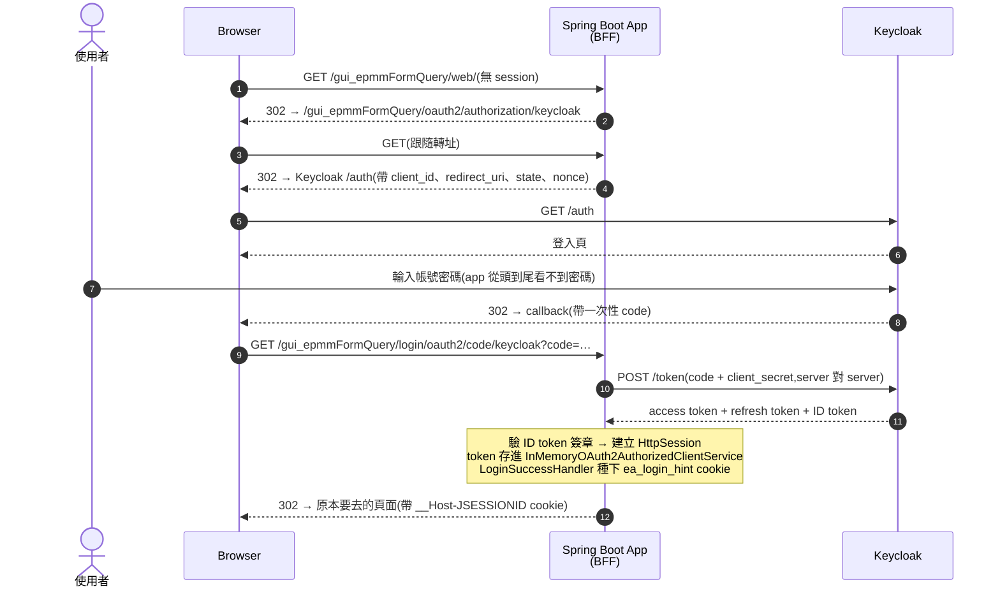
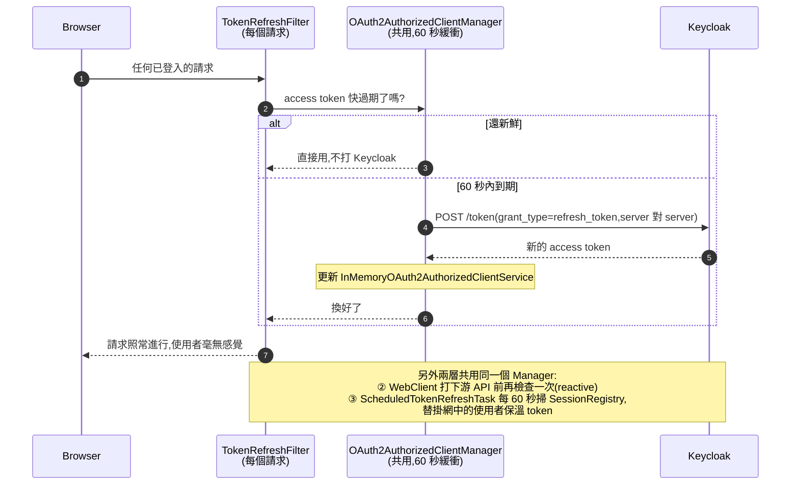
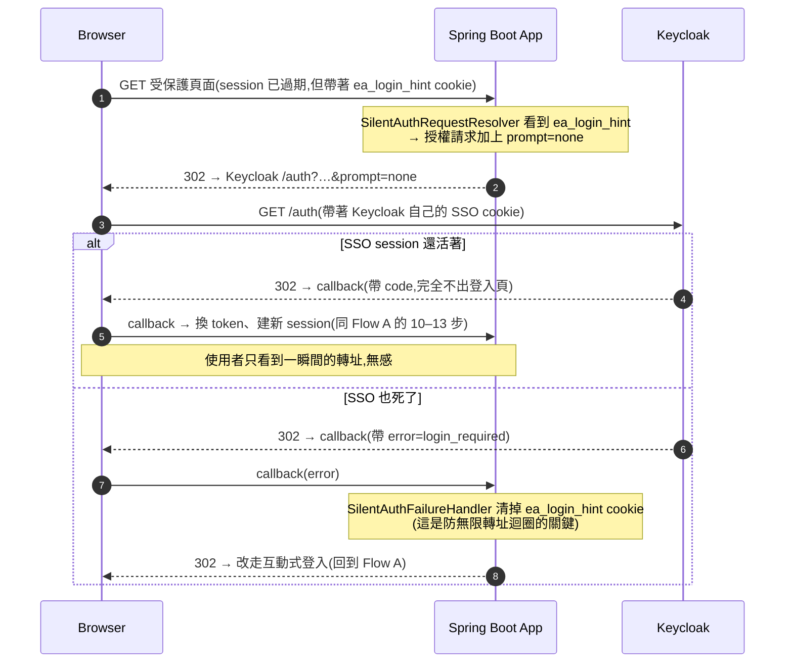

# 專案導讀 — 我們怎麼做登入:OAuth2、Keycloak,與從 Java 8 Adapter 到 Spring Security 的遷移故事

> **這份文件給誰看:** 團隊技術分享用的導讀,寫給「不一定熟 OAuth2,但想知道這個專案的登入為什麼長這樣」的同事。刻意以繁體中文撰寫(本 repo 其他文件皆為英文);所有技術名詞、類別名稱、設定鍵值保留英文原文。
>
> **想深入時的下一步:** `docs/auth-workflow.md`(英文完整版 walkthrough,含每條流程的 wire-level 細節與「什麼時候會再看到登入頁」矩陣)、`pmc-epmmformquerygui-COMPLETE.md`(完整敘事參考)、`docs/keycloak-realm-checklist.md`(正式環境 realm 設定值)。

---

## 目錄

- §1 — 什麼是 OAuth2、為什麼用 Keycloak
  - OAuth2、OIDC、SSO——三個名詞一次分清楚(用 Google 舉例)
- §2 — 傳統純 SPA 自己做 OAuth2:優點與代價
- §3 — 從前的做法:Java 8 + Keycloak Adapter
- §4 — 現在的做法:Java 17 + Spring Security oauth2Login
  - Flow A — 首次登入(Authorization Code Flow)
  - Flow B — Token Refresh(三層防線)
  - Flow C — Silent Re-auth(prompt=none)
- 結語

---

## §1 — 什麼是 OAuth2、為什麼用 Keycloak

先從問題說起:如果每個系統都自己做登入,密碼就散落在每個系統的資料庫裡,每個系統都要自己扛「保管密碼、防暴力破解、做 MFA、做密碼重設」這整套苦工。而且使用者每進一個系統就要登入一次。

OAuth2 的核心想法是:**應用程式不要碰密碼**。把「驗證使用者」這件事整個委託給一台大家都信任的中央伺服器,應用程式只拿到一組短命的通行證(token),憑證去做事。

| 名詞 | 一句話解釋 |
|---|---|
| **OAuth2** | 一個授權協定:app 把瀏覽器轉去授權伺服器登入,再拿回 token 代表使用者做事。app 從頭到尾看不到密碼 |
| **OIDC** (OpenID Connect) | 疊在 OAuth2 上面的身分層:多發一顆 **ID token**,以密碼學方式證明「這個人是誰」。OAuth2 管「你能做什麼」,OIDC 管「你是誰」 |
| **Keycloak** | 我們用的授權伺服器(open-source IdP)。登入頁、密碼、SSO session 都由它保管;我們的 app 在它那裡註冊為一個 **client** |

三個角色對到我們的專案:

| OAuth2 角色 | 在本專案裡是誰 |
|---|---|
| Resource Owner(資源擁有者) | 使用者本人 |
| Client(客戶端) | 我們的 Spring Boot app —— 是 *confidential client*,持有只存在於 pod 環境變數裡的 `client_secret` |
| Authorization Server(授權伺服器) | Keycloak |

登入成功後 Keycloak 一次發三顆 token:

| Token | 壽命(本專案) | 用途 |
|---|---|---|
| **Access token** | 約 5 分鐘 | 打下游 API 用的「現金」,故意設短——被偷走幾分鐘內就失效 |
| **Refresh token** | 跟著 SSO session | 用來換新 access token 的「提款卡」,只在 server 對 server 之間流動 |
| **ID token** | 登入當下 | 身分證明;登出時還要靠它讓 Keycloak 跳過確認畫面 |

### OAuth2、OIDC、SSO——三個名詞一次分清楚(用 Google 舉例)

實務上最常見的混淆,是把 OAuth2、OIDC、SSO 當成同一件事的三種說法。它們其實不是同一類東西:**OAuth2 和 OIDC 是協定,SSO 是體驗**。

- **OAuth2 是授權協定**——規範「這個 app 可以*代表我*做什麼」的委託機制,管的是*權限*。
- **OIDC 是疊在 OAuth2 上的身分層**——同一套轉址流程,多發一顆 ID token,回答「這個人*是誰*」,管的是*身分*。
- **SSO 是體驗、是結果**——「登入一次,到處通行」。它根本不是協定,而是中央伺服器保有自己的登入 session 所產生的*效果*。

三者互相獨立:只有一個 app 的時候,OAuth2 照跑,但沒有 SSO 可言;反過來,不用 OAuth2/OIDC 也能做出 SSO(SAML、Kerberos 走的就是別的協定);而 OIDC 則永遠跑在 OAuth2 的流程上。

用每個人都用過的 Google 來對照,三者的差別一目了然:

1. **相簿列印服務要讀你的 Google Drive 照片——這是 OAuth2(授權)。** 你被轉到 Google 的同意畫面,按下允許,列印服務就拿到一顆 token,可以代表你「讀照片」——但它拿不到你的密碼,甚至不在乎你是誰。被委託出去的是*權限*。
2. **某個網站上的「使用 Google 帳號登入」按鈕——這是 OIDC(身分)。** 一樣的轉址舞步,但這次網站要的不是你的資料,而是**確認你是誰**——所以多拿到一顆 ID token 當身分證明。同一套 OAuth2 流程,加上身分這一層,就是 OIDC。
3. **早上登入 Gmail,接著開 YouTube、Drive、Calendar 都不用再登入——這是 SSO(體驗)。** 因為 `accounts.google.com` 保有一份中央登入 session,每個 Google 服務都去問它「這個人登入過了嗎」。過程中沒有新協定出場——這是共用中央登入狀態產生的*效果*。

對回本專案:Keycloak 就是我們公司的 `accounts.google.com`,接上同一個 realm 的各系統就是 Gmail/YouTube/Drive,而本專案是其中之一。

| 名詞 | 是什麼 | Google 的例子 | 在本專案 |
|---|---|---|---|
| **OAuth2** | 授權協定(能做什麼) | 列印服務讀你的 Drive 照片 | Flow A 的 authorization code flow;app 拿 access token 打下游 API |
| **OIDC** | 身分層(你是誰) | 「使用 Google 帳號登入」 | app 靠 ID token 認得使用者(`UserInfoService` 讀的就是這些 claims) |
| **SSO** | 登入一次、到處通行的體驗 | 登入 Gmail 後開 YouTube 免登入 | Keycloak 的 SSO session:同 realm 系統互通,也是 Flow C silent re-auth 能無感成功的前提 |

> **為什麼 DevOps 特別需要分清楚:** 在 Keycloak realm 設定裡,這是不同層的旋鈕。**Access Token Lifespan**(約 5 分鐘)調的是 OAuth2 的 token 壽命;**SSO Session Idle / Max**(10h / 12–14h)調的是 SSO 的中央 session。分清楚概念,才知道 `docs/keycloak-realm-checklist.md` 裡每個值在動哪一層——以及為什麼有「SSO Session Idle 必須 ≥ servlet session 的 8h」這條鐵律(調錯的症狀:使用者隔天回來會莫名看到登入頁,而不是無感續登)。

> 想看完整的 token 生命週期圖與 DevOps 視角的設定旋鈕,請讀 `docs/auth-workflow.md` 開頭的「Intro — OAuth2 with Keycloak」primer。

---

## §2 — 傳統純 SPA 自己做 OAuth2:優點與代價

在講我們的做法之前,先看另一條很多團隊走的路:**讓前端自己做 OAuth2**。React SPA 引入 keycloak-js,在瀏覽器裡完成整個登入流程,token 由 JavaScript 保管;後端(如果有的話)退化成純 resource server,只負責驗 JWT。

**優點:**

- 前後端徹底分離,後端完全無 session、無狀態,任何一個 pod 都能服務任何請求,水平擴充最省事
- 前端全權掌控登入時機與 UX(什麼時候跳登入、什麼時候刷新)
- 後端程式最簡單:驗簽章、看 `exp`,結束

**代價:**

- **Token 存在瀏覽器裡**——任何一個 XSS 漏洞都可能把 access token 連同 refresh token 一起偷走帶去離線使用。這是最致命的一條
- SPA 是 *public client*,沒有 `client_secret`,只剩 PKCE 保護 code 交換
- 傳統的 silent refresh 靠隱藏 iframe 讀 Keycloak 的 SSO cookie——正好撞上現代瀏覽器封鎖第三方 cookie 的潮流,愈來愈不可靠
- Token 的保管、刷新、過期處理全部變成前端 JavaScript 的責任

我們選的是相反的路:**BFF(Backend-for-Frontend)**——token 全部留在 server 端,瀏覽器只拿到普通的 session cookie。§4 會展開。

> **鐵律(出自 `CLAUDE.md`):兩種模型絕對不能混用。** 前端若用了 keycloak-js,打受保護的 `/rs/**` XHR 會吃到後端的 302 轉 Keycloak,而 XHR 跟不過去(俗稱 "CORS on 302")。真要走前端拿 token 的路,後端就得整個改成 resource server,不能一半一半。
>
> 兩種模型的完整七軸比較表(XSS、client 型別、擴充性、silent SSO……)在 `docs/auth-workflow.md` §5,這裡不重複。

---

## §3 — 從前的做法:Java 8 + Keycloak Adapter

時間拉回 Java 8 的年代。當時 Spring Security 還沒有第一方的 OAuth2 client 支援,想接 Keycloak,官方給的路就是 **Keycloak adapter**:加一個 `keycloak-spring-boot-starter` 依賴,繼承 Keycloak 提供的 `KeycloakWebSecurityConfigurerAdapter`,再用 `keycloak.*` 這套 adapter 自家的設定體系(`keycloak.realm`、`keycloak.auth-server-url`、`keycloak.resource`、`keycloak.credentials.secret`)把 app 接上去:

```java
// 示意:當年的寫法(非本專案程式碼,此 API 已被棄用)
@KeycloakConfiguration
public class OldSecurityConfig extends KeycloakWebSecurityConfigurerAdapter {

    @Override
    protected void configure(HttpSecurity http) throws Exception {
        super.configure(http);
        http.authorizeRequests().anyRequest().authenticated();
    }
    // 另外還得自己補 KeycloakConfigResolver、
    // SessionAuthenticationStrategy 等一票 boilerplate…
}
```

它能動,我們也靠它跑了很多年。但痛點隨著時間愈來愈重:

1. **綁死在 Java 8 與舊 Spring 世代。** Adapter 只支援舊版 Spring Boot / Spring Security,等於整個技術棧被它釘在原地——想升 Java、升框架、用新特性,第一個擋路的就是它。
2. **Keycloak 官方棄用了 adapter。** Keycloak 在 [2022 年 2 月的官方公告](https://www.keycloak.org/2022/02/adapter-deprecation)宣布棄用大多數 adapter,並在 [2023 年 3 月的後續更新](https://www.keycloak.org/2023/03/adapter-deprecation-update)明確表示 Spring Boot adapter 不會支援 Spring Boot 3 / Spring Security 6,之後便停止隨新版 Keycloak 發布。繼續用,等於把登入安全跑在一套沒人維護的程式碼上。官方指的明路只有一條:**改用框架原生的 OAuth2/OIDC 支援**。
3. **Token refresh 得自己來,而且會出包。** Adapter 對 refresh 的支援很薄,實務上要自己手寫刷新邏輯——寫得不夠周全,就是偶發 401、使用者莫名被踢回登入頁,再花好幾天追一個「有時候會發生」的 bug。

> 公平地說:**當年這麼做並沒有錯。** 那個時代 adapter 就是唯一的正解。是世界變了——Spring Security 後來把 OAuth2/OIDC 做成了第一方功能,把 adapter 的存在理由整個掏空了。

---

## §4 — 現在的做法:Java 17 + Spring Security oauth2Login

遷移的核心決定只有一句話:**把「自家 adapter」換成「框架原生」。** Spring Security 6 的 `oauth2Login` 是 Spring 第一方、持續維護、跟著 Spring Boot 一起升級的 OAuth2/OIDC client——這正是 Keycloak 官方公告裡建議的方向。

改完之後最大的體會是:**OAuth2 協定裡那些又細又容易寫錯的步驟,Spring Security 全部都做好了,我們只是在設定它,而不是在實作它。**

| OAuth2 的苦工 | 現在誰做 |
|---|---|
| 組授權請求、轉向 Keycloak(含 `state`、`nonce` 防偽) | Spring Security 內建 |
| 驗證 callback、用 code + `client_secret` 換 token | Spring Security 內建 |
| 驗 ID token 簽章(自動抓 Keycloak 的 JWKS 公鑰) | Spring Security 內建 |
| 建立 session、寫入 SecurityContext | Spring Security 內建 |
| Token 保管與刷新 | Spring Security 的 `OAuth2AuthorizedClientManager` |
| RP-initiated logout(連 Keycloak 的 SSO 一起登出) | Spring Security 內建 handler |

這些在 §3 的年代,是「adapter 做一半、自己補一半」。現在整份設定的核心就只是 `application.yml` 裡這一段(本專案實際設定):

```yaml
spring:
  security:
    oauth2:
      client:
        registration:
          keycloak:
            client-id: ${KEYCLOAK_CLIENT_ID}
            client-secret: ${KEYCLOAK_CLIENT_SECRET}
            authorization-grant-type: authorization_code
            scope: openid, profile, email
            redirect-uri: "{baseUrl}/gui_epmmFormQuery/login/oauth2/code/{registrationId}"
        provider:
          keycloak:
            issuer-uri: ${KEYCLOAK_ISSUER_URI}
```

`SecurityConfig` 裡的 `oauth2Login()` DSL 也只是幾行:指定兩個 baseUri(因為本專案刻意不設 `server.servlet.context-path`,所有 URL 都明寫 `/gui_epmmFormQuery` 前綴)、掛上自訂的 resolver 和 handler,結束。

在這個地基上,本專案自己加的東西只有三件,也就是它的特色:

- **三層 token refresh**(Flow B)——確保 access token 永遠是新鮮的
- **Silent re-auth**(Flow C)——session 過期也不打擾使用者
- **BFF 架構**——token 永遠不進瀏覽器;瀏覽器只有三顆 cookie(`__Host-JSESSIONID`、`ea_login_hint`、`XSRF-TOKEN`),沒有任何一顆是 token

接下來用三張循序圖走完整個安全機制。這是本文的重點:看懂這三條流程,就看懂了這個專案。

### Flow A — 首次登入(Authorization Code Flow)

使用者第一次來,什麼 cookie 都沒有。這是教科書等級的 OAuth2 authorization code flow,全程由 Spring Security 驅動:



注意第 10–11 步:token 交換發生在 **server 對 server** 的通道上,瀏覽器只經手一次性的 `code`,拿到的只有 session cookie。這就是 BFF 的核心性質。

### Flow B — Token Refresh(三層防線,共用一個 Manager)

Access token 約 5 分鐘就過期(故意的)。要讓使用者無感,就得在它過期前偷偷換新。本專案有三層防線,全部共用 `TokenRefreshConfig` 裡那一個 `OAuth2AuthorizedClientManager`:



為什麼要三層?第一層顧「有在點頁面的人」,第二層顧「正要打 API 的呼叫」,第三層顧「頁面開著但人去開會了」的閒置使用者。任何一層換到新 token,另外兩層立刻受益,因為 token 存在同一個地方。

### Flow C — Silent Re-auth(session 死了,SSO 還活著)

App 的 session 只有 8 小時,但 Keycloak 的 SSO session 設 10 小時(刻意大於 8,見 `docs/keycloak-realm-checklist.md`)。所以「隔天早上回來」或「pod 重啟」時,常見的狀態是:**app 不認得你了,但 Keycloak 還認得**。這時不該讓使用者重打帳密——用 `prompt=none` 靜默重登:



失敗分支的那一步「清 cookie」看似不起眼,其實是整個機制的安全閥:不清掉的話,下一個請求又會帶著 hint 再試一次 `prompt=none`,又失敗、又重試——無限迴圈。

---

## 結語

回頭看這段遷移,重點從來不是「Java 8 升 Java 17」這個版本號,而是**認知的轉變**:登入這種安全關鍵的機制,應該交給第一方、有人持續維護、經過大規模驗證的框架去做。Spring Security 把 OAuth2/OIDC 的每個細節——`state`、`nonce`、簽章驗證、token 交換、刷新——都實作好了,我們的程式碼只負責兩件事:把它設定對,以及在它之上疊出符合本專案需求的體驗(三層 refresh、silent re-auth、BFF)。

至於登出:`KeycloakLogoutSuccessHandler` 做的是 RP-initiated logout,一次登出 app session 和 Keycloak SSO。完整的登出流程、以及「使用者到底什麼時候會再看到登入頁」的完整矩陣,請讀 `docs/auth-workflow.md`。

---

*本文由 `backend/` 原始碼整理而成(Spring Boot 3.5.x / Spring Security 6.5.x / Java 17)。關鍵類別:`SecurityConfig`、`TokenRefreshConfig`、`TokenRefreshFilter`、`ScheduledTokenRefreshTask`、`SilentAuthRequestResolver`、`SilentAuthFailureHandler`、`LoginSuccessHandler`、`KeycloakLogoutSuccessHandler`、`application.yml`。歷史事實來源:Keycloak 官方部落格 [2022-02 adapter deprecation](https://www.keycloak.org/2022/02/adapter-deprecation) 與 [2023-03 更新](https://www.keycloak.org/2023/03/adapter-deprecation-update)。*
